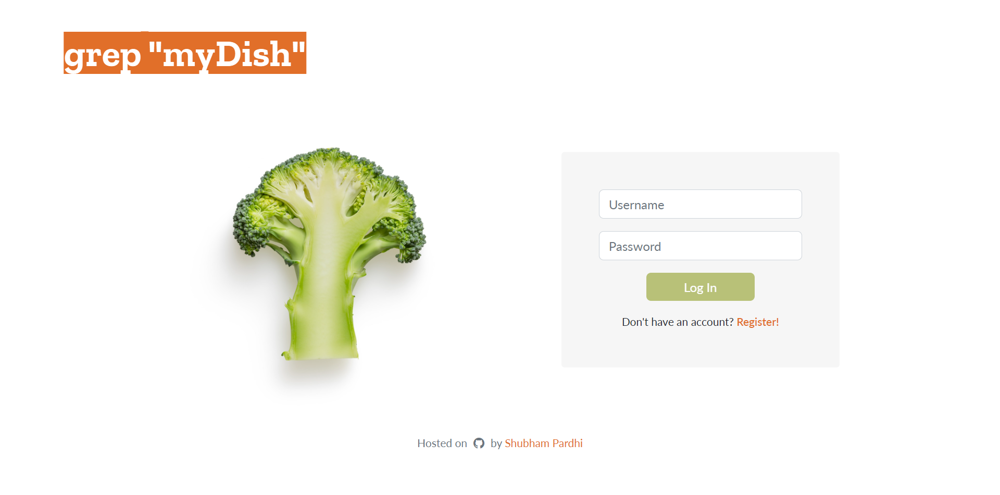

# grepDish
#### Video Demo:  https://youtu.be/3C45_Lrevho
#### Description: A web application that helps users find and bookmark recipes over internet.

Using the Edamam's API (https://developer.edamam.com/edamam-recipe-api)

### Functionality
- Login & Authorization
- A user can enter the ingredients (available) and get the recipe they can utilize this website for suggessions
- Websites supports register, it prompts if the user is already exists
- Allows to change username & passwords

### Login/ Register Page
Users have to create an account prior to using this application. Validation is implemented in both front end and back end. Users have to provide a name (which will be used to greet users in the index page), a minimum of four-alphanumeric-characters username that will be used to identify which user has logged in, and a password. The password stored in the database is hashed first, but for safety measures, PLEASE DO NOT USE YOUR ACTUAL PASSWORD!

### Index Page
Users can find recipes by ingredients / keywords in the text field, by checklists, or a combination of both. Input will be sent to back end via get request since we're only using it to retrieve a JSON data from the API.

### Text Field
The index page consists of a text field that can be added or removed dynamically with javascript (tutorial can be found here). Empty value in the text field is handled in the back end e.g. if users added four text field but only typed in two, the back end will recognize it as two keywords and the headline in the result page will only show these two keywords. User can also use the text field as it is, but a comma separated keywords is expected for this method.

### Checklists
There are four different categories available. Description of each label is taken from https://developer.edamam.com/edamam-docs-recipe-api:
1. Dish Type
2. Diet Labels
3. Allergies / Restrictions
4. Cuisine Type

### Result Page
Recipes that match users' input will be shown as cards in this page. These cards will only show minimal information for users to skim through. A click on these cards will show more information of the recipes via Bootstrap's modal. Users can go to the recipe's source link or add recipes to bookmarks from here.

### Bookmarks Page
Similar to the result page, recipes that are saved in this page will be shown as cards and bootstrap's modal is used to show more information about the recipe or to remove it.

### Settings
Users can change name, username, and password in this page. Validation is implemented in back end. Vertical tab tutorial can be found here.

### NAME
Users are free to use their name, a single letter, or even an emoji to be their name. Name will be displayed in the index page to greet users.

### USERNAME
Username should contain at least four alphanumeric characters. Username is unique and used to identify which user has logged in.

### PASSWORD
Password should be a minimum of eight alphanumeric characters and should not contain trailing spaces.

### Technologies used
1. Flask
2. Python
3. Javascript
4. HTML
5. CSS
6. Bootstrap 5
7. jQuery
8. Sqlite3

### Installation
- Clone / fork this repository.
- Create a virtual environment in your local project directory.
- Install the required libraries that are listed in requirements.txt.
- Sign up to Edamam's Recipe Search API to get your own API_ID and API_KEY.
- Save your API_ID and API_KEY in .env environment variable.
- Run the application: $ python3 app.py
